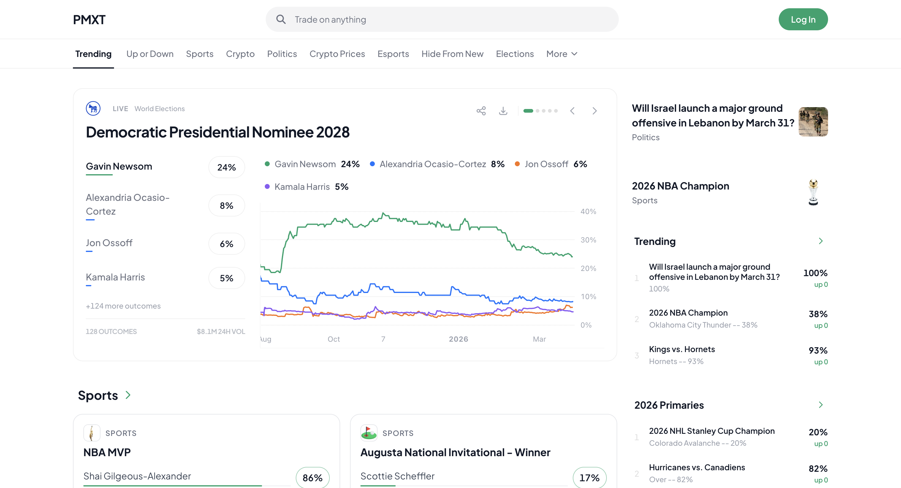

# Prediction Market Starter

A full-featured prediction market platform built with **Next.js**, **@pmxt/components**, and **@pmxt/sdk**. Clone, configure your API key, and deploy your own prediction market in minutes.

**Demo: [pmxt-white-label-integration-consum.vercel.app](https://pmxt-white-label-integration-consum.vercel.app/)**



## Features

- Browse events by category with search and filtering
- Real-time price charts with configurable time ranges (1H, 6H, 1D, 1W, 1M, ALL)
- Full trading interface with wallet-based order signing
- Portfolio dashboard with positions, P&L, and trade history
- Deposit and withdraw USDC via on-chain transactions
- Featured event carousel on the home page
- Sidebar with banners, trending markets, and custom sections
- Category navigation with overflow menu
- Fully themeable via CSS custom properties
- Server-side rendering with client hydration

## Tech Stack

- **Framework**: [Next.js](https://nextjs.org/) 16
- **Components**: [@pmxt/components](https://github.com/pmxt-dev/embed-components) -- prediction market UI kit
- **SDK**: [@pmxt/sdk](https://github.com/pmxt-dev/embed-sdk) -- API client for markets, trading, and portfolios
- **Wallet**: [RainbowKit](https://www.rainbowkit.com/) + [wagmi](https://wagmi.sh/) on Polygon
- **Charts**: [Lightweight Charts](https://www.tradingview.com/lightweight-charts/) by TradingView
- **Styling**: [Tailwind CSS](https://tailwindcss.com/) 4

## Getting Started

```bash
git clone https://github.com/pmxt-dev/prediction-market-starter
cd prediction-market-starter
npm install
```

## Running Locally

Create a `.env.local` file with your API credentials:

```bash
NEXT_PUBLIC_API_KEY=your-api-key
NEXT_PUBLIC_FEE_RATE=0.0025                    # optional
NEXT_PUBLIC_WALLETCONNECT_PROJECT_ID=           # optional, for WalletConnect
NEXT_PUBLIC_API_URL=https://custom-url.com      # optional, overrides the default PMXT API
```

Then start the development server:

```bash
npm run dev
```

Open [http://localhost:3000](http://localhost:3000) in your browser.

## Pages

| Route | Description |
|---|---|
| `/` | Home -- featured carousel, category sections, sidebar |
| `/event/[id]` | Event detail -- price chart, outcome rows, trade panel |
| `/category/[slug]` | Category browse -- grid/table view, sorting, search |
| `/portfolio` | Portfolio dashboard -- positions, activity, balances |

## Theming

All components are themed through CSS custom properties. Override any variable in `app/globals.css` to match your brand:

```css
:root {
  --brand-primary: #00a36c;
  --bg-main: #ffffff;
  --text-primary: #111827;
  --radius-card: 16px;
  --font-primary: "Plus Jakarta Sans", sans-serif;
  /* See globals.css for the full list */
}
```

## Deploy to Vercel

1. Push your fork to GitHub
2. Connect to [Vercel](https://vercel.com/) and import the repo
3. Add your environment variables in the Vercel dashboard
4. Deploy

## Project Structure

```
app/
  page.tsx                  # Home (server fetch + client hydration)
  event/[id]/page.tsx       # Event detail
  category/[slug]/page.tsx  # Category browse
  portfolio/                # Portfolio dashboard with tabs
components/
  Header.tsx                # Top nav with search
  SubHeader.tsx             # Category navigation bar
  Footer.tsx                # Footer
  Providers.tsx             # RainbowKit + React Query providers
```

## Related

- [`@pmxt/components`](https://github.com/pmxt-dev/embed-components) -- the component library this starter is built on
- [`@pmxt/sdk`](https://github.com/pmxt-dev/embed-sdk) -- the API client powering all data fetching
- [API Documentation](https://docs.pmxt.dev)
